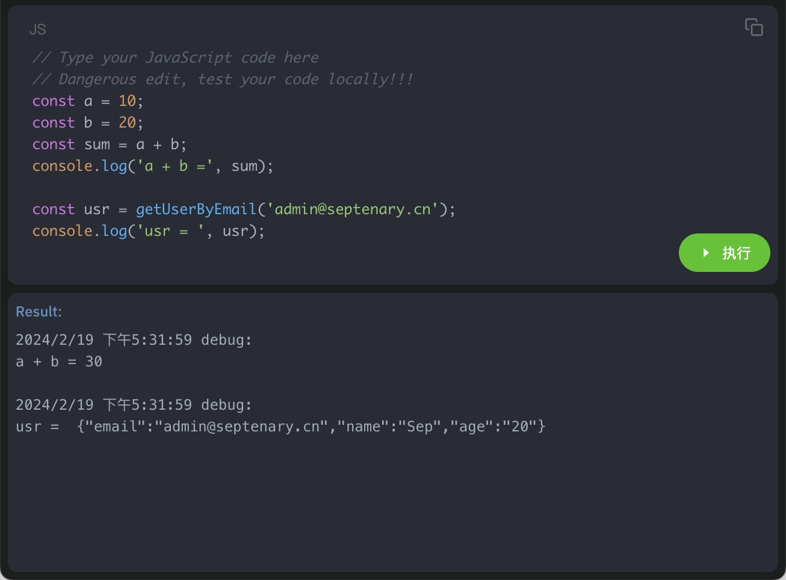

# Vue+Node 沙盒控制台工具

团队内部开发了很多 Web 平台的工具链，由于服务端逻辑比较复杂，生产环境上运行的服务涉及到的一些问题，排查起来相对困难，需要进入到当前服务内部查看运行情况，本文记录了一套对 NodeJS 服务通过包装 Node VM 沙盒模式，支持远程运行在前端编辑器上编写的代码

## 整体架构


首先前端用 vue 支持了一个代码编辑器，通过 axios api 请求将代码发送到 node server 端，在 vm 执行，然后返回执行结果给前端


## Vue 前端代码

前端代码比较简单，主要是基于 vue 技术栈对 CodeEditor 的封装 [source](https://github.com/oksep/vue-node-sandbox-console/blob/master/client/src/views/sandbox.vue)

## Node 后端代码

主要是对 node vm 的封装 [source](https://github.com/oksep/vue-node-sandbox-console/blob/master/server/src/utils/sandbox.ts)

```typescript
import vm, {Context, RunningScriptOptions, Script} from 'vm'
import {connectDBAsync, disconnectDBAsync} from '../db'

const globalConsole = global.console

// 沙盒日志
const sandboxConsole = (level: string, msg: any, ...args: any[]) => {
    console.result += `${new Date().toLocaleString()} ${level}:\n${msg}`
    args.forEach(item => {
        if (typeof item !== 'object') {
            console.result += ` ${item}`
        } else {
            console.result += ` ${JSON.stringify(item)}`
        }
    })
    console.result += '\n\n'
}

const console: { result: string, log: Function, warn: Function, error: Function } = {
    result: '',
    log: (msg: any, ...args: any[]) => {
        globalConsole.log('Sandbox console', msg, ...args)
        sandboxConsole('debug', msg, ...args)
    },
    warn: (msg: any, ...args: any[]) => {
        globalConsole.warn('Sandbox console', msg, ...args)
        sandboxConsole('Warn', msg, ...args)
    },
    error: (msg: any, ...args: any[]) => {
        globalConsole.error('Sandbox console', msg, ...args)
        sandboxConsole('Erro', msg, ...args)
    },
}

// vm 主要封装
// sandbox:any 是提供给前端允许调用的模块
// code 需要执行的代码
export default async function executeCodeInSandbox(sandbox: any, code?: string) {
    if (!code || code.trim().length === 0) {
        throw Error('Nothing executed.')
    }

    // 结构化代码
    const slices = code.trim().split(/\r?\n/)
        .map((l: string, i: number) => {
            return l.trimEnd()
        })
        .filter((l: string, i: number) => {
            return /^[A-Za-z0-9{}(&|]/.test(l.trimStart())
        })
    if (slices.length == 0) {
        throw Error('Nothing executed.')
    } else if (slices.length == 1) {
        code = slices[0]
    } else {
        code = slices.reduce((p: string, c: string, i: number, a: string[]) => {
            return `${p}\n    ${c}`
        })
    }

    // 对要调用的代码做一层安全包装，同时在执行前打开 DB，以便支持数据库查询操作
    let wrapCode = `globalConsole.log('VM exec in process:', process.pid, process.title)
try {
    console.result = ''
    await connectDBAsync()
    ${code}
    await disconnectDBAsync()
    inject(console.result)
} catch (e) {
    inject(e)
}`

    console.log(wrapCode);

    // 在 node:vm 中执行 code
    await (async (code: string) => {
        return new Promise((resolve) => {
            const script: Script = new vm.Script(`(async()=>{${code}})()`)
            const options: RunningScriptOptions = {
                timeout: 1000,
                displayErrors: true,
            }
            const context: Context = vm.createContext({
                ...sandbox,
                console,
                globalConsole,
                process,
                connectDBAsync,
                disconnectDBAsync,
                inject: (result: any) => {
                    sandbox.result = result
                    resolve(result)
                }
            })
            script.runInContext(context, options)
        })
    })(wrapCode)

    // 返回代码执行结果
    return sandbox.result // util.inspect(sandbox.result)
}
```

Koa 路由接收 http 请求

```typescript
import Router from 'koa-router'
import Koa from "koa"
import executeCodeInSandbox from "../utils/sandbox";
import { getUserByEmail } from '../db/userDao';


// modules which register in sandboxEnv, the code can reference only !!!
const sandboxEnv: any = {
    require,
    getUserByEmail
}

export const sandboxRouter: Router = new Router()

sandboxRouter.post('execute-code', '/execute-code', async (ctx: Koa.Context) => {
    const { codeData } = ctx.request.body as { codeData?: string }
    let result: any
    console.log('sandbox exec start...\n', codeData)
    try {
        result = await executeCodeInSandbox({ ...sandboxEnv }, codeData)
        if (typeof result !== 'object') {
            result = `${result}`
        }
    } catch (e: any) {
        result = e.stack ? e.stack : `${e}`
        console.error('sandbox exec error', result)
    }
    console.log('sandbox exec end...\n', result)
    ctx.body = {
        result: result
    }
})

```

这里需要注意, server 端可以将 sandboxEnv(utils/daos 等模块) 注册到了沙盒 vm context 中，只有注册到沙盒中的模块，前端代码才能够调用的到！


在前端代码编辑器中编写代码查看运行效果:

